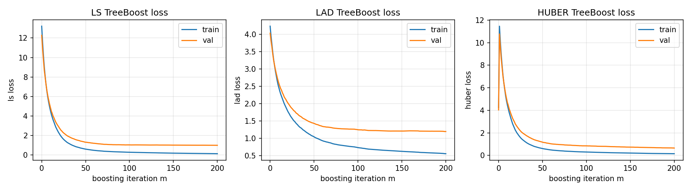
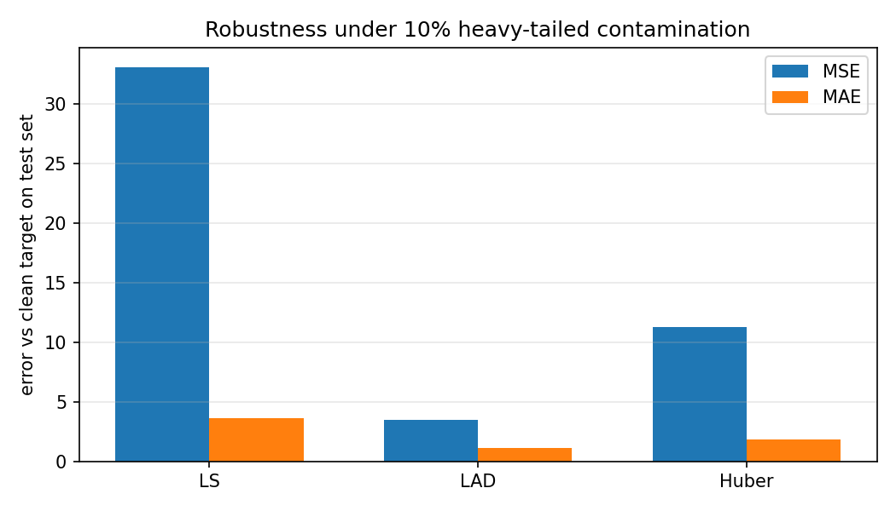
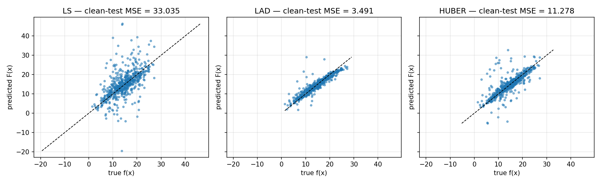
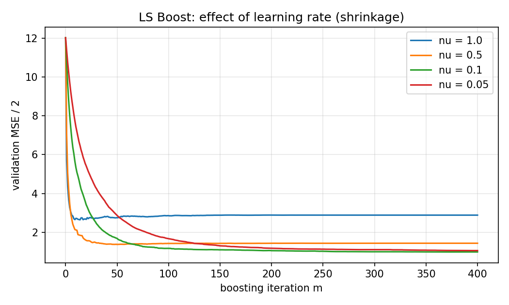

<!-- _class: lead -->

# Greedy Function Approximation:
## A Gradient Boosting Machine

**Jerome H. Friedman** — *Annals of Statistics*, 2001

Reading + from-scratch implementation
LS Boost · LAD TreeBoost · M (Huber) TreeBoost

---

## Roadmap

1. Why we need this paper — the problem and the literature
2. The key insight: *gradient descent in function space*
3. Three regression algorithms: LS, LAD, Huber TreeBoost
4. The terminal-region update — the practical heart of TreeBoost
5. From-scratch implementation in Python
6. Experiments: convergence, robustness, shrinkage
7. What the results reveal & the paper's lasting impact

---

## The function-estimation problem

Given training data $\{(\mathbf{x}_i, y_i)\}_{i=1}^N$, find a function $F$
minimizing the expected loss

$$F^* = \arg\min_F\, \mathbb{E}_{y,\mathbf{x}}\, L(y, F(\mathbf{x})).$$

- Regression: $L(y,F) = (y-F)^2$ or $|y-F|$.
- Classification: $L = \log(1 + e^{-2yF})$ for $y \in \{-1, 1\}$.

<div class="keypoint">

Most existing methods restrict $F$ to a parametric family and tackle a hard
joint optimization. **This paper takes a non-parametric, stagewise route.**

</div>

---

## Where this paper sits

<div class="columns">
<div>

### Before (1995–2000)

- **AdaBoost** (Freund & Schapire, 1996) — re-weights examples; tied to exponential loss.
- **LogitBoost** (Friedman, Hastie, Tibshirani, 2000) — binomial likelihood via Newton steps.
- Basis-function methods: MARS, RBF, SVM, neural nets.

</div>
<div>

### This paper

- One unifying view: *boosting is gradient descent in function space.*
- Plug in **any** differentiable loss.
- Concrete algorithms for LS, LAD, Huber, and K-class logistic.
- Adds tools to interpret tree boosters.

</div>
</div>

<span class="tiny">After: XGBoost (2014), LightGBM (2017), CatBoost (2017) — all extend this paradigm.</span>

---

## Stagewise additive expansions

Approximate $F$ by a sum of simple "weak learners":

$$F(\mathbf{x};\, \{\beta_m, \mathbf{a}_m\}) = \sum_{m=1}^{M} \beta_m\, h(\mathbf{x};\, \mathbf{a}_m).$$

- $h(\mathbf{x}; \mathbf{a})$ — a small parametric function (e.g. a regression tree).
- Joint optimization over all $(\beta_m, \mathbf{a}_m)$ is generally hard.

Greedy **stagewise** alternative — at each step $m$:

$$(\beta_m, \mathbf{a}_m) = \arg\min_{\beta, \mathbf{a}} \sum_{i=1}^{N}
  L\!\left(y_i,\, F_{m-1}(\mathbf{x}_i) + \beta\, h(\mathbf{x}_i;\mathbf{a})\right).$$

<span class="tiny">Eq. (9) of the paper. Previous terms are frozen — no re-fitting.</span>

---

## The key insight

### Boosting = numerical optimization in function space

Treat $F(\mathbf{x}_i)$ at each training point as a free parameter.
The **negative gradient** at iteration $m$ is

$$\tilde{y}_i = -\!\left[\frac{\partial L(y_i, F(\mathbf{x}_i))}
                     {\partial F(\mathbf{x}_i)}\right]_{F(\mathbf{x})\,=\,F_{m-1}(\mathbf{x})}.$$

These are **pseudo-responses**: the direction in which moving $F(\mathbf{x}_i)$
most reduces the loss.

<div class="keypoint">

**Why this matters:** the gradient is only defined at training points. Fit a
weak learner $h(\mathbf{x}; \mathbf{a}_m)$ to the pseudo-responses by least
squares — that's the smooth, generalizable approximation to the unconstrained
gradient.

</div>

---

## Algorithm 1 — Gradient Boost (generic)

```
1.  F_0(x) = arg min_ρ Σ_i L(y_i, ρ)
2.  for m = 1, …, M:
3.      ỹ_i = − [ ∂L(y_i, F(x_i)) / ∂F(x_i) ]_{F = F_{m−1}}     # pseudo-responses
4.      a_m = arg min_{a, β} Σ_i [ ỹ_i − β h(x_i; a) ]²         # least-squares fit
5.      ρ_m = arg min_ρ Σ_i L(y_i, F_{m−1}(x_i) + ρ h(x_i; a_m))
6.      F_m(x) = F_{m−1}(x) + ρ_m h(x; a_m)
```

- **Line 3** is loss-specific — everything else is the same machinery.
- **Line 4** is least squares — fast and well-understood, regardless of the original loss.
- **Line 5** is a 1-D line search in the original loss.

---

## Algorithm 2 — LS Boost

With $L(y,F) = \tfrac{1}{2}(y-F)^2$:

- Pseudo-response: $\tilde y_i = y_i - F_{m-1}(\mathbf{x}_i)$ — *residuals*.
- Line 4 fits the current residuals; line search becomes trivial.
- Initial constant: $F_0 = \bar y$.

<div class="keypoint">

Reduces to the classical "fit residuals iteratively" recipe — the
*reality check* for the framework.

</div>

```python
class LeastSquaresLoss(Loss):
    def initial_prediction(self, y):     return float(np.mean(y))
    def negative_gradient(self, y, F):   return y - F            # residuals
    def leaf_update(self, y, F, idx):    return float(np.mean((y - F)[idx]))
```

---

## Algorithm 3 — LAD TreeBoost

With $L(y,F) = |y-F|$:

- Pseudo-response: $\tilde y_i = \operatorname{sign}(y_i - F_{m-1}(\mathbf{x}_i))$.
- Trees are fit by least squares to *signs* of residuals.
- Initial constant: $F_0 = \mathrm{median}(y)$.

<div class="keypoint">

**Crucial step:** the per-leaf update is the *median of residuals in the leaf*,
not the leaf mean. The tree's leaf values are *overwritten* with these medians.

</div>

$$\gamma_{jm} = \mathrm{median}_{\mathbf{x}_i \in R_{jm}}\!\left(y_i - F_{m-1}(\mathbf{x}_i)\right)$$

<span class="tiny">This is equation (18) specialized to $L_1$. It is what makes the method robust.</span>

---

## Algorithm 4 — M TreeBoost (Huber)

Quadratic for small residuals, linear in the tail:

$$L(y,F) = \begin{cases}
    \tfrac{1}{2}(y-F)^2, & |y-F| \le \delta \\
    \delta\,|y-F| - \delta^2/2, & |y-F| > \delta
  \end{cases}$$

- Adaptive $\delta_m = \mathrm{quantile}_\alpha(|r_i|)$ at each iteration.
- Pseudo-response: residual when $|r|\le\delta$, else $\delta\,\operatorname{sign}(r)$.
- Leaf update is Friedman's 1-step Newton-like adjustment around the leaf median:

$$\gamma_{jm} = \tilde r_{jm} + \frac{1}{N_{jm}}\!\!\sum_{\mathbf{x}_i \in R_{jm}}\!\!
            \operatorname{sign}(r_i - \tilde r_{jm})\,
            \min(\delta_m,\, |r_i - \tilde r_{jm}|).$$

---

## The terminal-region update — the secret sauce

Two stages per iteration when the weak learner is a tree:

1. **Build** a $J$-leaf tree by *least squares* on the pseudo-responses $\tilde y$.
2. **Re-solve** a tiny 1-D problem inside each leaf using the *original loss*:
   $$\gamma_{jm} = \arg\min_\gamma \sum_{\mathbf{x}_i \in R_{jm}} L(y_i,\, F_{m-1}(\mathbf{x}_i) + \gamma).$$
3. **Update**: $F_m(\mathbf{x}) = F_{m-1}(\mathbf{x}) + \nu \cdot \gamma_{jm}$ for $\mathbf{x}$ in leaf $R_{jm}$.

<div class="keypoint">

**Why this is the crux:** the LS-fit tree is a fast, smooth gradient
direction; the loss-specific $\gamma_{jm}$ re-injects the original loss's
geometry — robust medians for LAD, clipped sums for Huber, Newton steps for
logistic.

</div>

---

## From-scratch implementation

One clean abstraction does all the work:

```python
class Loss(ABC):
    def initial_prediction(self, y): ...           # F_0
    def negative_gradient(self, y, F): ...         # ỹ_i  (line 3)
    def leaf_update(self, y, F, indices): ...      # γ_jm (eq. 18)
    def update_state(self, y, F): ...              # e.g. Huber's δ_m
```

| File | Role |
|------|------|
| `src/treeboost/tree.py` | CART-style regression tree, best-first growth, vectorized split search |
| `src/treeboost/losses.py` | LS / LAD / Huber, each ~30 LOC |
| `src/treeboost/model.py` | `TreeBoostRegressor` drives Algorithms 2/3/4 with shrinkage $\nu$ |

<span class="tiny">No scikit-learn, XGBoost, LightGBM, or CatBoost. Only `numpy` for arrays. 30 passing pytest tests.</span>

---

## Custom regression tree (the weak learner)

- **Best-first growth** — repeatedly expand the leaf with the highest SSE-reduction split until `max_leaves = J` is reached.
- **Vectorized split search** — sort each feature column, pre-compute cumulative sums of $\tilde y$, evaluate all valid split points in one shot:

$$\text{gain}(s) = \frac{S_L^2}{n_L} + \frac{S_R^2}{n_R} - \frac{S^2}{n}.$$

- **Honors $J$ directly** — same complexity knob the paper uses (Section 5).
- **Leaf-id API** (`apply`, `set_leaf_values`) — boosting driver maps each row to its leaf, computes $\gamma_{jm}$ per leaf, and overwrites the LS leaf means.

<span class="tiny">Roughly 200 lines, deterministic, and readable. Built for correctness over throughput.</span>

---

## Experiment 1 — convergence on a clean signal

<div class="columns">
<div>

Friedman-#1 target

$f(\mathbf{x}) = 10\sin(\pi x_0 x_1) + 20(x_2-0.5)^2 + 10x_3 + 5x_4$

$n_\text{train} = n_\text{test} = 600$, $\sigma=1.0$ Gaussian noise.
$M=200$, $\nu=0.1$, $J=8$.

| Loss | test MSE | test MAE |
|------|---------:|---------:|
| LS   | 1.989    | 1.136    |
| LAD  | 2.309    | 1.194    |
| Huber| 1.977    | 1.124    |

Under Gaussian noise: **LS ≈ Huber**; LAD pays the small efficiency cost.

</div>
<div>



<span class="tiny">Train (blue) and validation (orange) loss curves per iteration.</span>

</div>
</div>

---

## Experiment 2 — robustness under contamination

<div class="columns">
<div>

Same target, but **10%** of training labels perturbed by heavy-tailed shocks ($\pm 25 \cdot t_3$). Test set is *clean*.

| Loss | clean MSE | clean MAE |
|------|----------:|----------:|
| LS   | 33.04     | 3.63      |
| LAD  | 3.49      | 1.17      |
| Huber| 11.28     | 1.84      |

- **LS collapses** — squared loss is dominated by outliers.
- **LAD recovers** almost completely (medians ignore extremes).
- **Huber** is much better than LS, ranking depends on $\delta$.

</div>
<div>



<span class="tiny">Clean-test error per loss under 10% contamination.</span>

</div>
</div>

---

## Predicted vs true under contamination



LS predictions drift well off the diagonal; LAD and Huber stay calibrated despite the noisy training labels. **This is the picture Section 4 of the paper promises.**

---

## Experiment 3 — shrinkage trade-off

<div class="columns">
<div>

LS Boost on the clean signal, sweeping the learning rate $\nu$.

- **$\nu=1.0$**: hits the floor in ~30 iterations, then plateaus.
- **$\nu=0.1$**: lower final validation MSE — but takes ~150–200 trees.
- **$\nu=0.05$**: slowest; needs more iterations to compete.

<div class="keypoint">

Reproduces the standard recommendation that emerged from this paper:
**moderate shrinkage + larger $M$ generalizes better.**

</div>

</div>
<div>



<span class="tiny">Validation MSE/2 vs boosting iteration for several $\nu$ values.</span>

</div>
</div>

---

## What worked & what didn't

<div class="columns">
<div>

### <span class="pill good">Worked</span>

- The 3-method `Loss` interface kept the boosting loop tiny and loss-agnostic.
- Best-first tree growth honored $J$ cleanly with no extra plumbing.
- Unit tests written against the paper's equations (e.g. Algorithm 4 leaf update) caught the real bugs early.
- Experiments reproduced the qualitative paper claims: LS=reality check, LAD/Huber robust, shrinkage helps.

</div>
<div>

### <span class="pill warn">Honest limits</span>

- CART splitter is correct but slow — fine for a few hundred trees, not industrial.
- No subsampling, no influence trimming (regression scope by design).
- Huber's exact ranking depends strongly on the quantile chosen for $\delta$.
- LAD training loss is non-monotone per-iteration because `sign(r)` discards magnitude.

</div>
</div>

---

## What the results reveal

- **Function-space framing isn't just exposition.** Once `Loss` exposes three methods, adding a new regression loss takes minutes.
- **The terminal-region update is the practical heart.** Without it, LAD would degenerate; with it, leaves carry medians and the method is genuinely robust.
- **Robustness has a small efficiency cost.** LAD ≈16% worse than LS on clean data; LS ≈10× worse than LAD under contamination — the asymmetry favors using a robust default.
- **Shrinkage = nearly-free regularization.** Smaller $\nu$, larger $M$, better generalization, more compute.

---

## The paper's lasting impact

- **Unified boosting.** Loss-agnostic boosting became *the* standard framing.
- **Modern descendants:**
  - **XGBoost** (Chen & Guestrin, 2014) — adds 2nd-order terms, regularization, sparsity-aware splits.
  - **LightGBM** (Ke et al., 2017) — histogram binning, leaf-wise growth.
  - **CatBoost** (Prokhorenkova et al., 2018) — ordered boosting, target encoding.
- **Interpretation tools** (variable importance, partial dependence) come straight from this paper's TreeBoost section.
- Still cited as the canonical reference for "what is gradient boosting?"

---

<!-- _class: lead -->

# Thank you

## Questions?

Code, tests, experiments, and analysis writeup are all in the project repo.

`src/treeboost/` · `tests/` · `experiments/` · `analysis.md` · `README.md`
